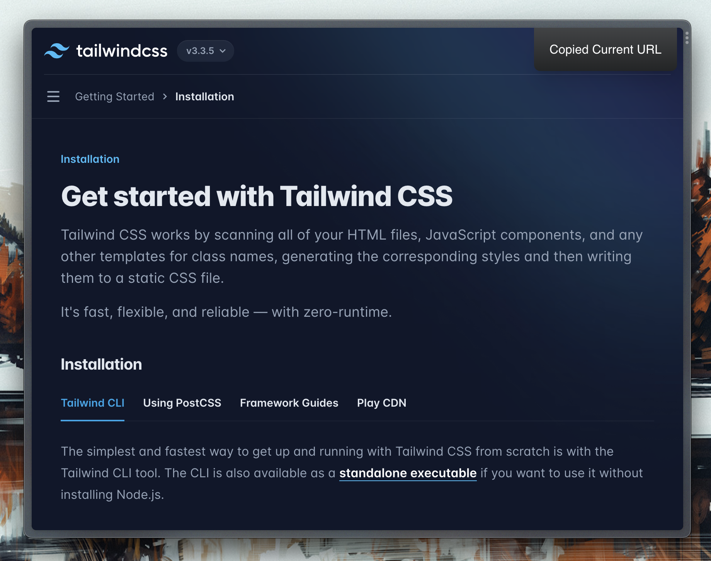

# Copy Current URL Browser Extension

A browser extension to quickly copy the current tab's URL with cmd+shift+c (or ctrl+shift+c on Windows).

Inspired by one of [Arc's](https://arc.net/) [great features](https://x.com/joshm/status/1712163012851753375?s=20).

## Installation

The extension is available on the [Chrome web store](https://chromewebstore.google.com/detail/kjfaieigmkklodbpcnadhkmbfjapgljd/preview?hl=en&pli=1). You can also load the unpacked extension directly.

## Contributing

Contributions are welcome!
